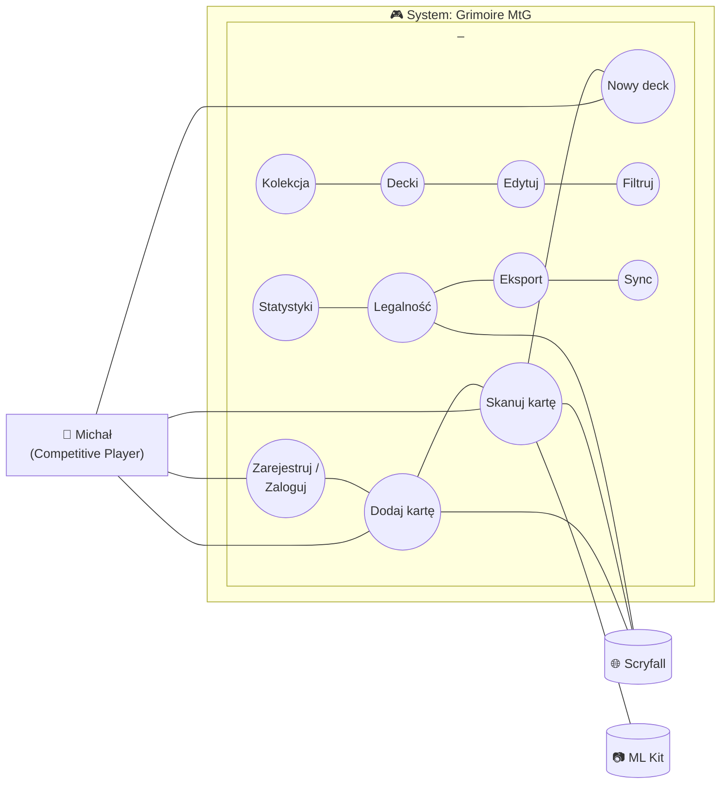
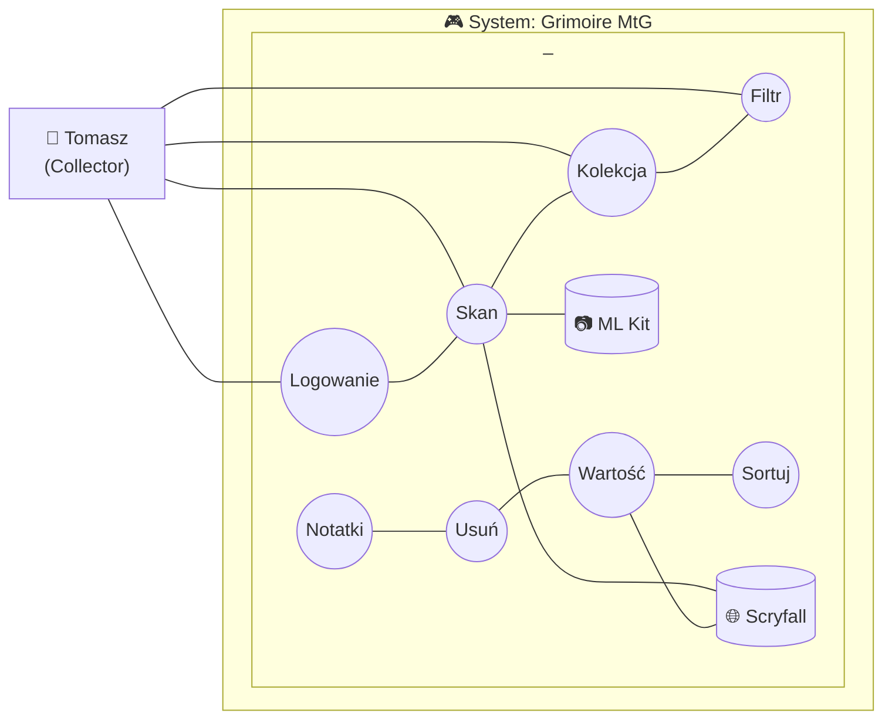
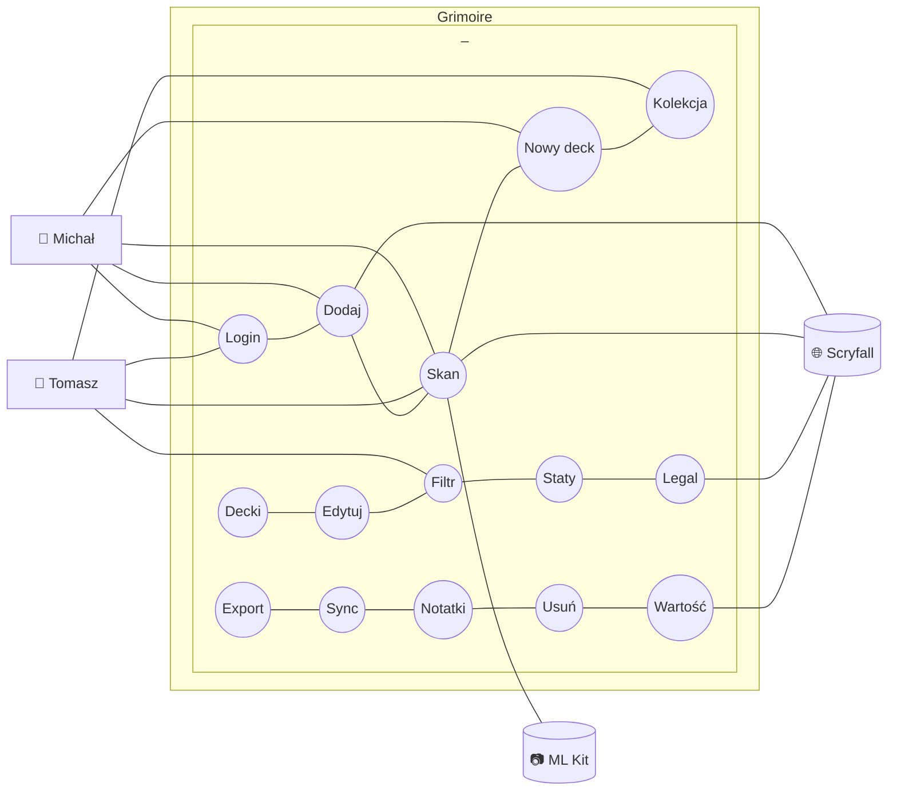

# Diagramy przypadków użycia (UML) — Grimoire MtG

## Diagram 1: Aktor — Michał Nowak (Competitive Player)

---

## Diagram 2: Aktor — Tomasz Wiśniewski (Collector)

---

## Diagram 3: Pełny diagram systemu — wszyscy aktorzy

