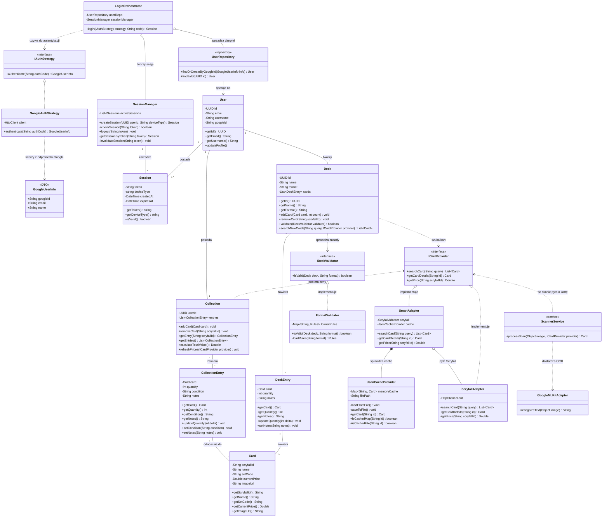

# Diagram klas — Grimoire MtG

```mermaid
classDiagram

    class IAuthStrategy {
        <<interface>>
        +authenticate(String authCode) GoogleUserInfo
    }

    class GoogleAuthStrategy {
        -HttpClient client
        +authenticate(String authCode) GoogleUserInfo
    }

    class LoginOrchestrator {
        -UserRepository userRepo
        -SessionManager sessionManager
        +login(IAuthStrategy strategy, String code) Session
    }

    class GoogleUserInfo {
        <<DTO>>
        +String googleId
        +String email
        +String name
    }

    class Session {
        -string token
        -string deviceType
        -DateTime createdAt
        -DateTime expiresAt
        +getToken() string
        +getDeviceType() string
        +isValid() boolean
    }

    class SessionManager {
        -List~Session~ activeSessions
        +createSession(UUID userId, String deviceType) Session
        +checkSession(String token) boolean
        +logout(String token) void
        -getSessionByToken(String token) Session
        -invalidateSession(String token) void
    }

    class User {
        -UUID id
        -String email
        -String username
        -String googleId
        +getId() UUID
        +getEmail() String
        +getUsername() String
        +updateProfile()
    }

    class UserRepository {
        <<repository>>
        +findOrCreateByGoogleId(GoogleUserInfo info) User
        +findById(UUID id) User
    }

    class Card {
        -String scryfallId
        -String name
        -String setCode
        -Double currentPrice
        -String imageUrl
        +getScryfallId() String
        +getName() String
        +getSetCode() String
        +getCurrentPrice() Double
        +getImageUrl() String
    }

    class CollectionEntry {
        -Card card
        -int quantity
        -String condition
        -String notes
        +getCard() Card
        +getQuantity() int
        +getCondition() String
        +getNotes() String
        +updateQuantity(int delta) void
        +setCondition(String condition) void
        +setNotes(String notes) void
    }

    class Collection {
        -UUID userId
        -List~CollectionEntry~ entries
        +addCard(Card card) void
        +removeCard(String scryfallId) void
        +getEntry(String scryfallId) CollectionEntry
        +getEntries() List~CollectionEntry~
        +calculateTotalValue() Double
        +refreshPrices(ICardProvider provider) void
    }

    class DeckEntry {
        -Card card
        -int quantity
        -String notes
        +getCard() Card
        +getQuantity() int
        +getNotes() String
        +updateQuantity(int delta) void
        +setNotes(String notes) void
    }

    class Deck {
        -UUID id
        -String name
        -String format
        -List~DeckEntry~ cards
        +getId() UUID
        +getName() String
        +getFormat() String
        +addCard(Card card, int count) void
        +removeCard(String scryfallId) void
        +validate(IDeckValidator validator) boolean
        +searchNewCards(String query, ICardProvider provider) List~Card~
    }

    class ICardProvider {
        <<interface>>
        +searchCard(String query) List~Card~
        +getCardDetails(String id) Card
        +getPrice(String scryfallId) Double
    }

    class JsonCacheProvider {
        -Map~String, Card~ memoryCache
        -String filePath
        -loadFromFile() void
        -saveToFile() void
        +getCard(String id) Card
        +isCachedMap(String id) boolean
        +isCachedFile(String id) boolean
    }

    class ScryfallAdapter {
        -HttpClient client
        +searchCard(String query) List~Card~
        +getCardDetails(String id) Card
        +getPrice(String scryfallId) Double
    }

    class SmartAdapter {
        -ScryfallAdapter scryfall
        -JsonCacheProvider cache
        +searchCard(String query) List~Card~
        +getCardDetails(String id) Card
        +getPrice(String scryfallId) Double
    }

    class IDeckValidator {
        <<interface>>
        +isValid(Deck deck, String format) boolean
    }

    class FormatValidator {
        -Map~String, Rules~ formatRules
        +isValid(Deck deck, String format) boolean
        -loadRules(String format) Rules
    }

    class ScannerService {
        <<service>>
        +processScan(Object image, ICardProvider provider) Card
    }

    class GoogleMLKitAdapter {
        +recognizeText(Object image) String
    }

    GoogleAuthStrategy ..> GoogleUserInfo : tworzy z odpowiedzi Google
    IAuthStrategy  <|.. GoogleAuthStrategy
    LoginOrchestrator ..> IAuthStrategy : używa do autentykacji
    LoginOrchestrator o-- UserRepository : zarządza danymi
    LoginOrchestrator o-- SessionManager : tworzy sesję
    UserRepository ..> User : operuje na

    SessionManager "1" -- "*" Session : zarzadza

    User "1" -- "0..*" Session : posiada
    User "1" -- "1" Collection : posiada
    User "1" -- "*" Deck : tworzy

    Collection "1" -- "*" CollectionEntry : zawiera
    CollectionEntry "1" -- "1" Card : odnosi sie do
    Deck "1" -- "*" DeckEntry : zawiera
    DeckEntry "1" -- "1" Card : zawiera

    ICardProvider <|.. SmartAdapter : implementuje
    ICardProvider <.. Collection : pobiera ceny

    SmartAdapter o-- ScryfallAdapter : pyta Scryfall
    ICardProvider <|.. ScryfallAdapter  : implementuje

    SmartAdapter *-- JsonCacheProvider : sprawdza cache
    
    ICardProvider <.. ScannerService : po skanie pyta o kartę
    ScannerService ..> GoogleMLKitAdapter : dostarcza OCR
    

    IDeckValidator <|.. FormatValidator : implementuje

    Deck ..> ICardProvider : szuka kart
    Deck ..> IDeckValidator : sprawdza zasady


```