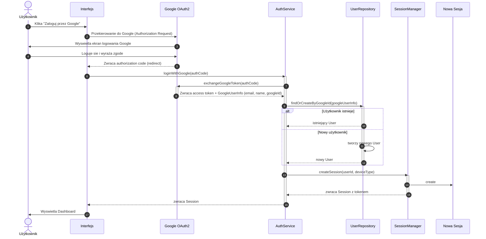
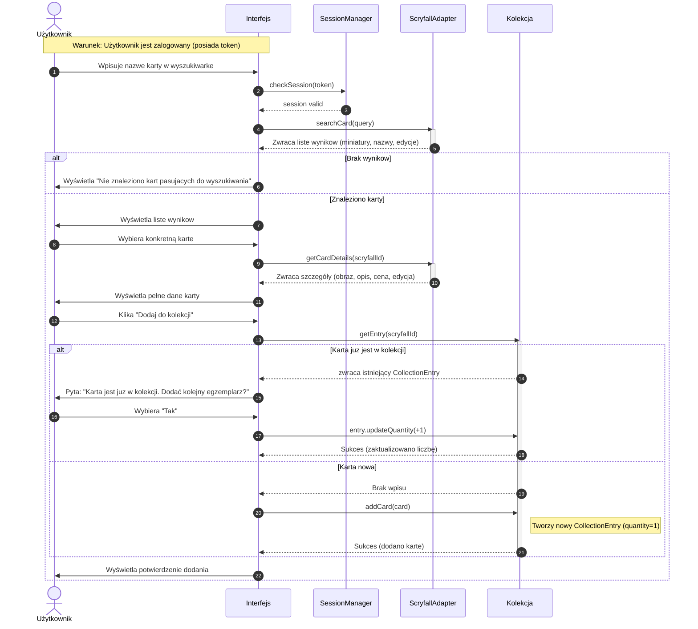
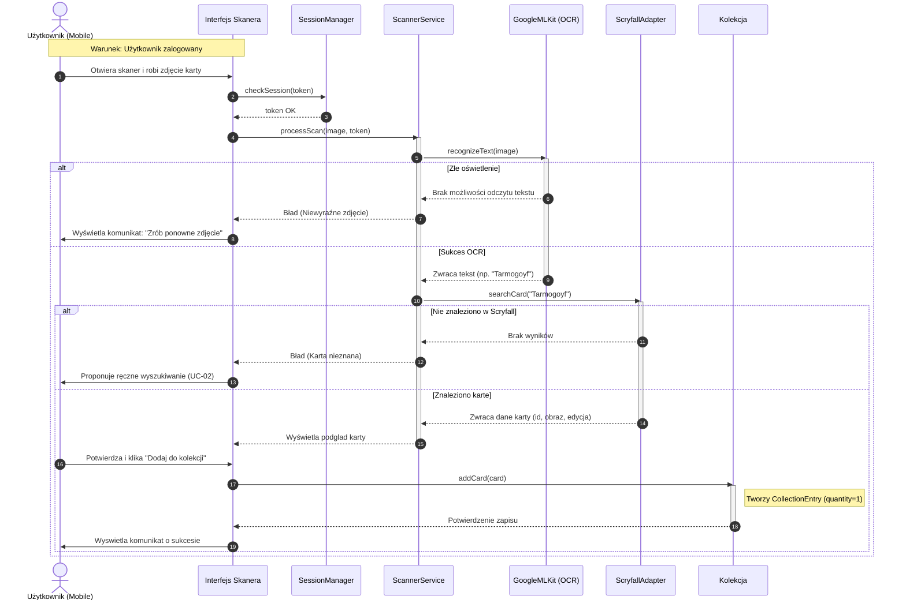
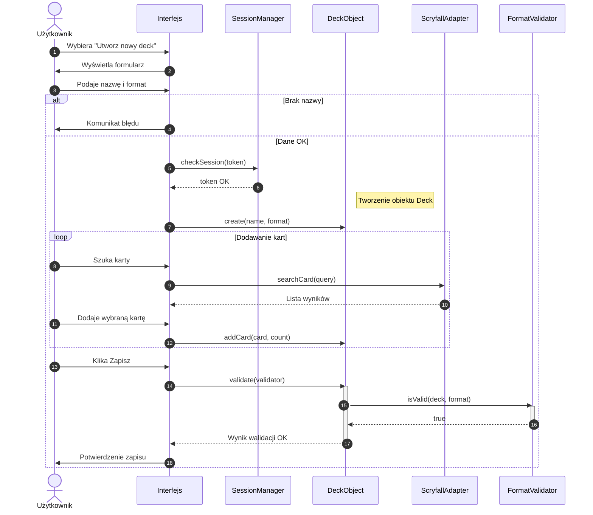
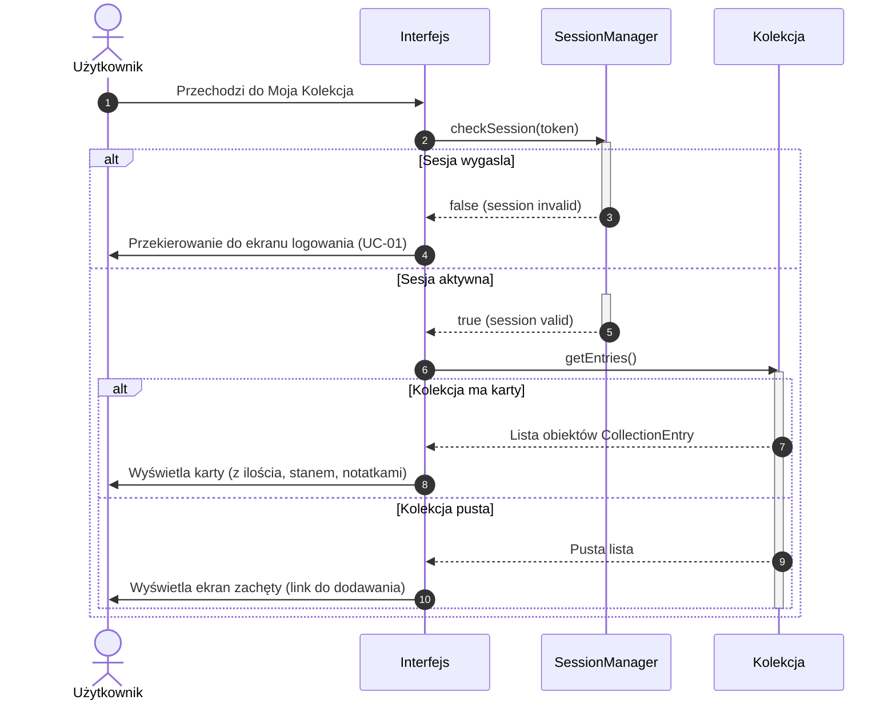
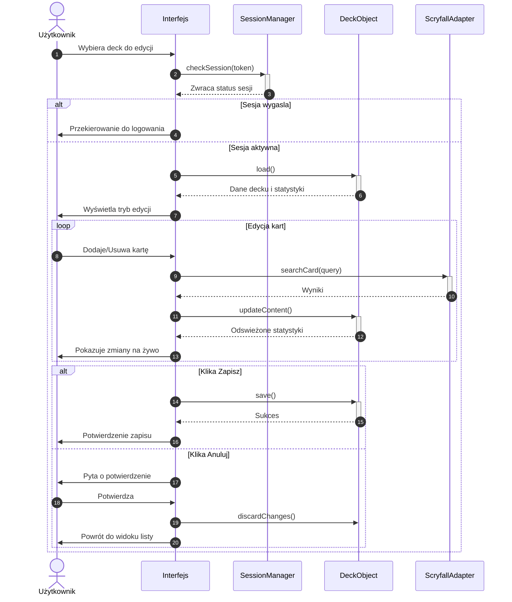
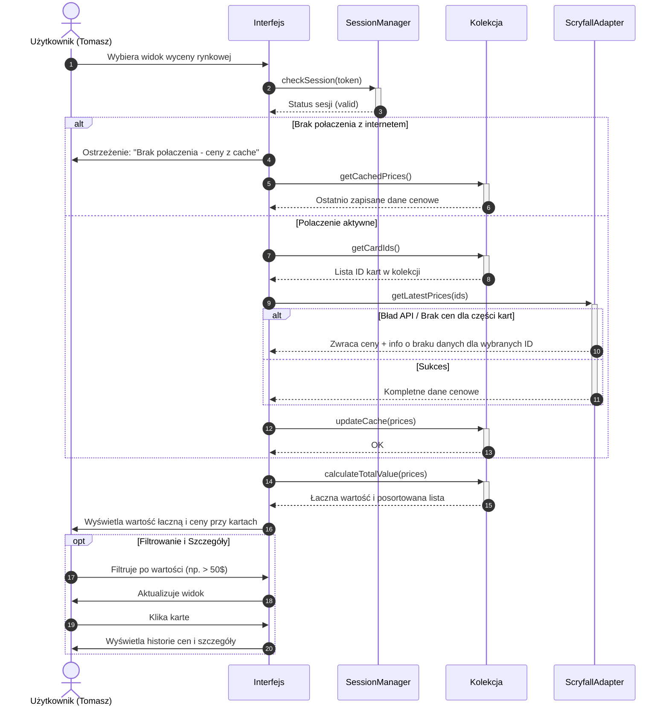

# Diagramy sekwencji — Grimoire MtG

## UC-01 — Logowanie przez Google OAuth2

## UC-02 — Ręczne wyszukiwanie i dodawanie karty

## UC-03 — Skanowanie karty kamerą/aparatem i dodanie do kolekcji

## UC-04 — Tworzenie nowego decku

## UC-05 — Przegladanie kolekcji z weryfikacją sesji

## UC-06 — Edycja istniejacego decku

## UC-07 — Sprawdzenie wartosci kolekcji

